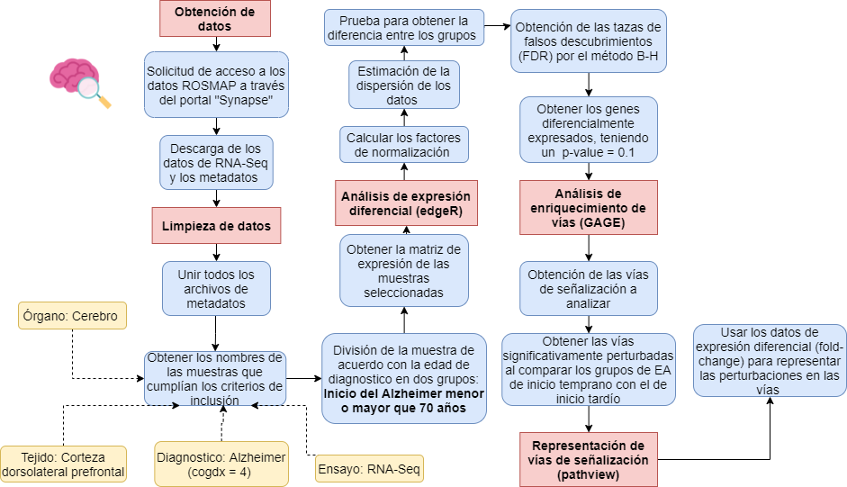

# Biologia de Redes Aplicada a Enfermedades del Sistema Nervioso Central

## Resumen 

La Enfermedad de Alzheimer (EA) es un desorden neurodegenerativo caracterizado por un déficit cognitivo y funcional gradualmente progresivo, así como cambios de comportamiento y está asociado con una gran variedad factores para tener en cuenta para su desarrollo, entre los cuales destacan el nivel de educación, el estado socioeconómico del individuo, el cuidado de la salud de los pacientes, problemas tanto cerebrovasculares como en el sistema inmune y cambios en el microambiente del tejido cerebral. El gran impacto de esta patología en la población mundial y la complejidad de las variables para tener en cuenta en su estudio ha llevado a los investigadores a categorizarla como una enfermedad compleja, en donde sus principales características son la existencia de diversos niveles en los cuales puede ser estudiada (genes, transcritos, proteínas, células) y las interacciones no lineales que suelen presentar entre sus componentes. Además, se han reportado numerosas diferencias entre las variantes de la EA de inicio temprano e inicio tardío que abarcan desde implicaciones en el comportamiento y habilidades de los individuos afectados hasta diferencias en el microambiente y en la fisiología del tejido cerebral.

Por las razones anteriormente mencionadas, en el presente estudio se utilizaron los datos de expresión génica provenientes del proyecto ROSMAP (Religious Orders Study and Memory and Aging Project) para estudiar los genes diferencialmente expresados entre las variantes de la enfermedad de Alzheimer de inicio temprano (grupo control) e inicio tardío (grupo experimental), a través de los enfoques de **biología de redes, análisis de expresión diferencial, análisis de vías de señalización alteradas**, entre otros.

---

## Herramientas utilizadas
- Lenguaje de Programación: R 

### Librerias

#### General
- dplyr 1.0.7
- tidyverse 1.3.1
- plyr 1.8.6
- data.table 1.14.2

#### Plots
- ggplot2 3.3.5
- ggpubr 0.4.0
- ggrepel 0.9.1

#### Teoría de la información 
- minet 3.48.0

#### Redes
- igraph 1.2.7
- graphite 1.36
- tidygraph 1.2.0
- ggraph 2.0.5
- Rgraphviz 2.34.0

#### Expresión diferencial
- edgeR 3.32.1

#### Análisis de vías de señalización 
- Gage 2.40.2
- pathview 1.30.1

#### Gene code
- AnnotationDbi 1.52.0
- org.Hs.eg.db 3.12.0

## Objetivos
- **Basándose en los conceptos de biología de redes, caracterizar el Alzheimer de inicio temprano e inicio tardío para la identificación de posibles áreas de interés biológico.**
- Identificar un conjunto de datos de utilidad para el análisis del Alzheimer
- Preprocesamiento de los datos obtenidos
- Análisis de expresión diferencial de genes, vías y redes

## Metodología 

## Conclusiones 
Se logró llevar a cabo el análisis de expresión diferencial y vías a los datos provenientes del proyecto ROSMAP, caracterizando perturbaciones significativas en la expresión de genes de los individuos con LOAD, los cuales están relacionados con las vías de señalización implicadas en enfermedades cardiovasculares y en procesos fundamentales para el ciclo de vida de las neuronas.
