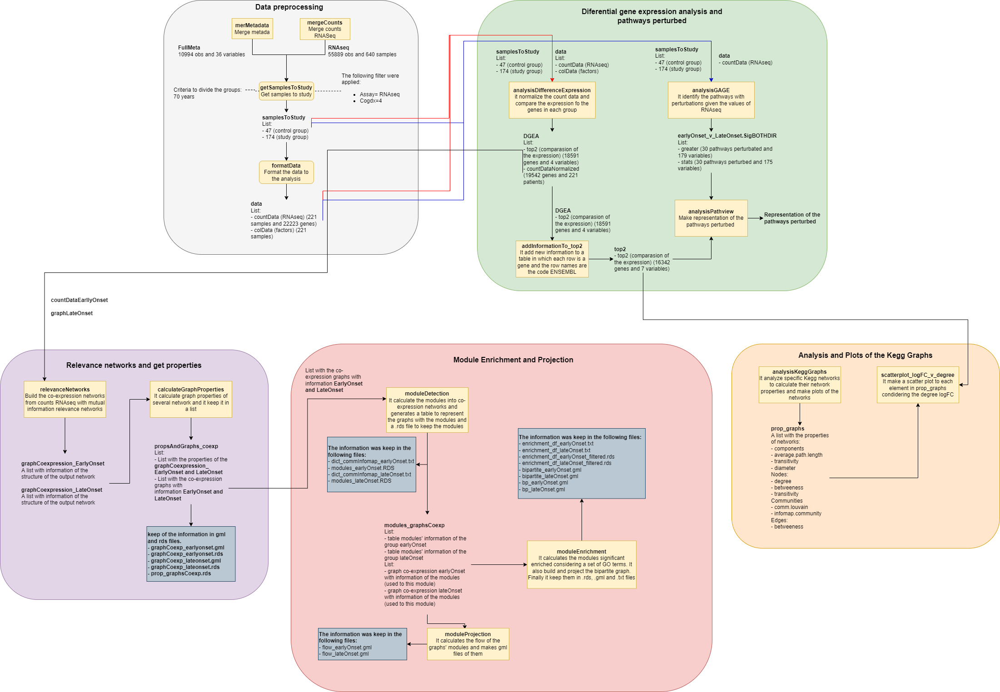

# Network Biology Applied to the Alzheimer's Disease

[README English](READMEEnglish.md)
- [Network Biology Applied to the Alzheimer's Disease](#network-biology-applied-to-the-alzheimers-disease)
  - [Objectives](#objectives)
    - [Generals](#generals)
  - [Metodology](#metodology)
  - [Conclusion](#conclusion)
  - [Used tools](#used-tools)
    - [Packages](#packages)
      - [General](#general)
      - [Plots](#plots)
      - [Information theory](#information-theory)
      - [Networks](#networks)
      - [Differential gene expression analysis](#differential-gene-expression-analysis)
      - [Enrichment analysis](#enrichment-analysis)
      - [Gene code](#gene-code)

## Objectives
### Generals

## Metodology

## Conclusion

---

## Used tools
- Prgramming Language: R 

### Packages

#### General
- dplyr 1.0.7
- tidyverse 1.3.1
- plyr 1.8.6
- data.table 1.14.2

#### Plots
- ggplot2 3.3.5
- ggpubr 0.4.0
- ggrepel 0.9.1

#### Information theory
- minet 3.48.0

#### Networks
- igraph 1.2.7
- graphite 1.36
- tidygraph 1.2.0
- ggraph 2.0.5
- Rgraphviz 2.34.0

#### Differential gene expression analysis 
- edgeR 3.32.1

#### Enrichment analysis
- Gage 2.40.2
- pathview 1.30.1

#### Gene code
- AnnotationDbi 1.52.0
- org.Hs.eg.db 3.12.0
