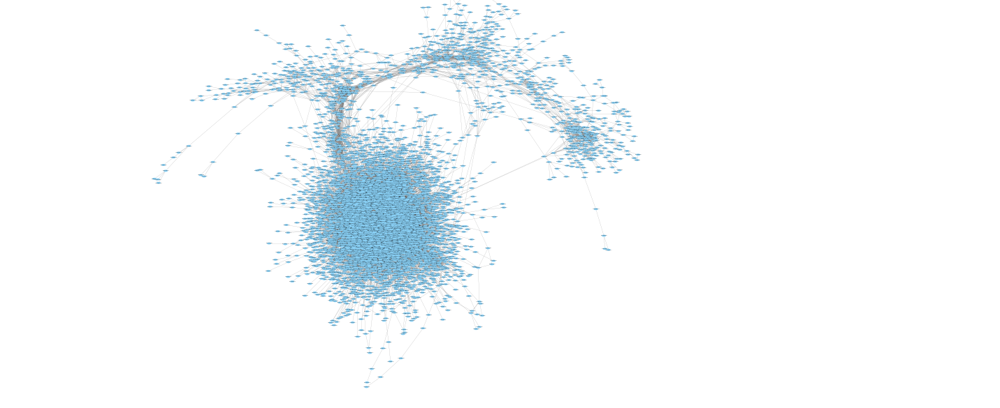
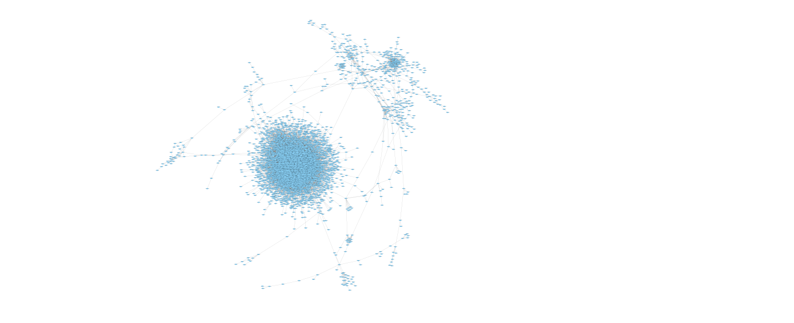

```{r setup, include=FALSE}
knitr::opts_chunk$set(echo = TRUE)
library(knitr)
library(ggplot2)
library(dplyr)
prop_graphs <- readRDS(file = "E:/DataROSMAPNetwork/Data/prop_graphs.rds")
```


## Propiedades generales
### Membership 
```{r fig.width=8}
# Inicio temprano 
summary(prop_graphs[[1]]$components$membership)

# Inicio tardio 
summary(prop_graphs[[2]]$components$membership)

ggplot(data = data.frame(IDCluster = c(prop_graphs[[1]]$components$membership, 
                                       prop_graphs[[2]]$components$membership), 
                         type = rep(c("earlyOnset", "lateOnset"), each = 19542)), 
       mapping = aes(x= IDCluster, fill = type)) + geom_density(alpha = 0.4)

#plot(density(prop_graphs[[1]]$components$membership), xlab = "ID del cluster")
#lines(density(prop_graphs[[2]]$components$membership))
```

### Número de Clusters

```{r}
kable(data.frame(earlyOnset = prop_graphs[[1]]$components$no, 
                 lateOnset = prop_graphs[[2]]$components$no))
```


### Tamaño de los clusters 
```{r fig.width=8}
# Inicio temprano 
summary(prop_graphs[[1]]$components$csize)
# Inicio tardio 
summary(prop_graphs[[2]]$components$csize)

par(mfrow = c(2,1), mar = c(4, 3, 1, 1))
barplot(table(prop_graphs[[1]]$components$csize), xlab = "Tamaños de los clusters", 
        main = "Inico temprano")
barplot(table(prop_graphs[[2]]$components$csize), xlab = "Tamaños de los clusters", 
        main = "Inicio tardio")
```

### Rutas más cortas entre nodos 
```{r}
kable(data.frame(earlyOnset = prop_graphs[[1]]$average.path.length, 
                 lateOnset = prop_graphs[[2]]$average.path.length))
```

### Transitividad 
```{r}
kable(data.frame(earlyOnset = prop_graphs[[1]]$transitivity, 
                 lateOnset = prop_graphs[[2]]$transitivity))
```

### Diametro 
```{r}
kable(data.frame(earlyOnset = prop_graphs[[1]]$diameter, 
                 lateOnset = prop_graphs[[2]]$diameter))

```

## Propiedades de los nodos

### Degree 
```{r}
# Inicio temprano 
summary(prop_graphs[[1]]$nodes$degree)

# Inicio tardio 
summary(prop_graphs[[2]]$nodes$degree)


ggplot(data = data.frame(Degree = c(prop_graphs[[1]]$nodes$degree, 
                                       prop_graphs[[2]]$nodes$degree), 
                         type = rep(c("earlyOnset", "lateOnset"), each = 19542)), 
       mapping = aes(x= Degree, fill = type)) + geom_density(alpha = 0.4)
```

### Betweeneess
```{r}
# Inicio temprano 
summary(prop_graphs[[1]]$nodes$betweenness)
# Inicio tardio 
summary(prop_graphs[[2]]$nodes$betweenness)
```

### Transitividad 
```{r fig.width=8}
# Inicio temprano 
summary(prop_graphs[[1]]$nodes$transitivity)
# Inicio tardio 
summary(prop_graphs[[2]]$nodes$transitivity)


ggplot(data = data.frame(transitivity = c(prop_graphs[[1]]$nodes$transitivity, 
                                       prop_graphs[[2]]$nodes$transitivity), 
                         type = rep(c("earlyOnset", "lateOnset"), each = 19542)), 
       mapping = aes(x= type,  y = transitivity, fill = type)) + 
  scale_y_continuous(name = "Transitividad") + 
  stat_boxplot(geom = "errorbar", width = 0.2) + geom_boxplot()

```

### Clustering Louvain 
```{r}
# Inicio temprano 
summary(prop_graphs[[1]]$nodes$comm.louvain)
# Inicio tardio 
summary(prop_graphs[[2]]$nodes$comm.louvain)


ggplot(data = data.frame(communities = c(prop_graphs[[1]]$nodes$comm.louvain, 
                                       prop_graphs[[2]]$nodes$comm.louvain), 
                         type = rep(c("earlyOnset", "lateOnset"), each = 19542)), 
       mapping = aes(x= communities, fill = type)) + geom_density(alpha = 0.4)
```

## Propiedades de los edges 

```{r}
# Inicio temprano 
summary(prop_graphs[[1]]$edges$betweenness)
# Inicio tardio 
summary(prop_graphs[[2]]$edges$betweenness)
```

## Exploración de algunos genes 

Valores membership de los genes pertenecientes a clusters con el mayor tamaño
```{r}
prop_graphs$earlyOnset$components$membership[prop_graphs$earlyOnset$components$csize  == 11738]
```

Valores membership de genes pertenencientes a clusters de un tamaño mayor a 50 
```{r}
prop_graphs$earlyOnset$components$membership[prop_graphs$earlyOnset$components$csize  > 50 ]
```

Gen con el mayor degree 
```{r}
prop_graphs$earlyOnset$nodes[c(1, 2)] %>% filter(degree ==2435)
```

Genes con niveles altos de degree 
```{r}
prop_graphs$earlyOnset$nodes[c(1, 2)] %>% filter(degree >= 2300)
```

## Redes 

### Early Onset 


