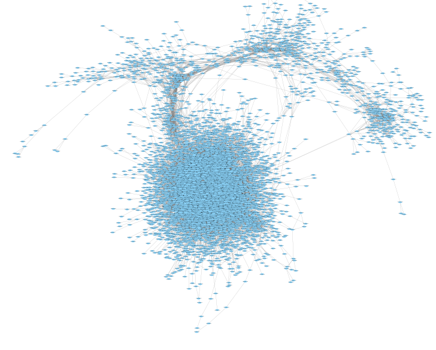
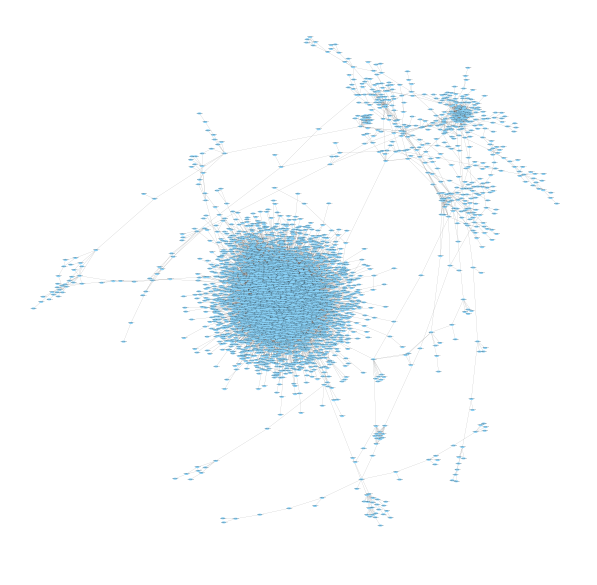

```{r setup, include=FALSE}
knitr::opts_chunk$set(echo = TRUE)
library(ggplot2)
library(ggthemes)
library(ggpubr)
library(dplyr)
prop_graphs_flow <- readRDS("Data/prop_graphs_flow.RDS")
prop_graphs_bipartite <- readRDS("Data/prop_graphs_bipartite.RDS")
prop_graphs_relevance_networks <- readRDS("E:/DataROSMAPNetwork/DataOnlyWithSymbol/prop_graphs.rds")
```

```{r echo=FALSE}
#prop_graphs_relevance_networks <- readRDS("E:/DataROSMAPNetwork/Data/prop_graphs.rds")
#dataHist <- table(prop_graphs_relevance_networks[[1]]$nodes$degree)
#dataHist2 <- table(prop_graphs_relevance_networks[[2]]$nodes$degree)
#dotchart(as.numeric(dataHist), pch = 19, color = "red")


#dataHist <- table(prop_graphs_flow[[1]]$nodes$degree)
#dataHist <- table(prop_graphs_flow[[2]]$nodes$degree)
#dotchart(as.numeric(dataHist), pch = 19, color = "red")

#plot(density(prop_graphs[[1]]$components$membership), xlab = "ID del cluster")
#lines(density(prop_graphs[[2]]$components$membership))
```


## Redes reconstruidas a partir de Relevance Networks 

A partir de datos de expresión genica se reconstruyeron los redes correspondientes a los pacientes 
A partir de Relevance Networks se recontruyo la red para Alzheimer de inico temprano y Alzheimer de inicio tardio tomando como limite el quantil 0.99 de acuerdo al valor de Información Mutua (MI). 
 


En las representaciones de la red se puede observar una gran densidad en ciertos puntos de 

## Co-expression network
```{r echo=FALSE}
#ggplot(data = data.frame(names_nod = names(dataHist), data = as.vector(dataHist)), mapping = aes(x=names_nod, y=data)) + geom_point()

dataHist <- table(prop_graphs_relevance_networks[[1]]$nodes$degree)
prueba <- as.data.frame(dataHist)
dataHist2 <- table(prop_graphs_relevance_networks[[2]]$nodes$degree)
prueba2 <- as.data.frame(dataHist2)

ggplot(data = prueba, mapping = aes(x=as.numeric(Var1), y=Freq)) + 
      geom_point() + scale_x_log10() + scale_y_log10() + ylab("Number of nodes") + 
      ggpubr::theme_pubclean() + theme(legend.title = element_blank())

ggplot(data = prueba2, mapping = aes(x=as.numeric(Var1), y=Freq)) + 
      geom_point() + scale_x_log10() + scale_y_log10() + ylab("Number of nodes") + 
      ggpubr::theme_pubclean() + theme(legend.title = element_blank())
```
```{r echo=FALSE}
# Prepare the data to be ploted 
plot_degree <- data.frame(num_nodes = c(prueba$Freq, prueba2$Freq), Degree = c(as.numeric(prueba$Var1),
    as.numeric(prueba2$Var1)), type = c(rep("Early Onset", each = nrow(prueba)), rep("Late Onset", each = nrow(prueba2))))
    
#    type = rep(c("earlyOnset", "lateOnset"), each = 16319))
    
ggplot(data = plot_degree, mapping = aes(x= Degree, y = num_nodes, col = type)) + 
        geom_point(alpha = 0.3, size = 2) + scale_x_log10() + scale_y_log10() + 
        ggthemes::scale_color_ptol() + ylab("Number of nodes") + 
        ggpubr::theme_pubclean() + theme(legend.title = element_blank())
```
```{r}
# association 
chisq.test(prop_graphs_relevance_networks[[1]]$nodes$degree, prop_graphs_relevance_networks[[2]]$nodes$degree)

library(vcd)
assocstats(xtabs(~prop_graphs_relevance_networks[[1]]$nodes$degree+prop_graphs_relevance_networks[[2]]$nodes$degree))
```


```{r echo=FALSE}
table_graph1 <- read.table("D:/OneDrive - UNIVERSIDAD NACIONAL AUTÓNOMA DE MÉXICO/Productividad/ProyectosProgramacion/BiologiaDeRedesAplicadaAEnfermedadesDelSNC/ROSMAP/PruebaModuleEnrichmentAndProjection/resultsWithOnlySymbl/dict_commInfomap_cntrl.txt", header = TRUE, sep = "\t")

dataHistModules1 <- table(table_graph1$infomap)
dataModules1 <- as.data.frame(dataHistModules1)

ggplot(data = dataModules1, mapping = aes(x=as.numeric(Var1), y=Freq)) + geom_point() + scale_x_log10() + scale_y_log10()

table_graph2 <- read.table("D:/OneDrive - UNIVERSIDAD NACIONAL AUTÓNOMA DE MÉXICO/Productividad/ProyectosProgramacion/BiologiaDeRedesAplicadaAEnfermedadesDelSNC/ROSMAP/PruebaModuleEnrichmentAndProjection/resultsWithOnlySymbl/dict_commInfomap_cases.txt", header = TRUE, sep = "\t")


dataHistModules2 <- table(table_graph2$infomap)
dataModules2 <- as.data.frame(dataHistModules2)

ggplot(data = dataModules2, mapping = aes(x=as.numeric(Var1), y=Freq)) + geom_point() + scale_x_log10() + scale_y_log10()
```

```{r echo=FALSE}
# Prepare the data to be ploted 
plot_modules <- data.frame(size_module = c(dataModules1$Freq, dataModules2$Freq), rank_module = c(as.numeric(dataModules1$Var1),
    as.numeric(dataModules2$Var1)), type = c(rep("Early Onset", each = nrow(dataModules1)), rep("Late Onset", each = nrow(dataModules2))))

ggplot(data = plot_modules, mapping = aes(x= rank_module, y = size_module, col = type)) + 
        geom_point(alpha = 0.3, size = 2)  + scale_y_log10() + 
        ggthemes::scale_color_ptol() + ylab("Module size") + 
        ggpubr::theme_pubclean() + theme(legend.title = element_blank())
```

## Projected modules 

```{r echo=FALSE}
#ggplot(data = data.frame(names_nod = names(dataHist), data = as.vector(dataHist)), mapping = aes(x=names_nod, y=data)) + geom_point()

dataHistProj <- table(prop_graphs_flow[[1]]$nodes$degree)
dataProj <- as.data.frame(dataHistProj)

dataHistProj2 <- table(prop_graphs_flow[[2]]$nodes$degree)
dataProj2 <- as.data.frame(dataHistProj2)

ggplot(data = dataProj, mapping = aes(x=as.numeric(Var1), y=Freq)) + 
        geom_point() + scale_x_log10() + scale_y_log10() + ylab("Number of nodes") + 
        ggpubr::theme_pubclean() + theme(legend.title = element_blank())

ggplot(data = dataProj2, mapping = aes(x=as.numeric(Var1), y=Freq)) + 
        geom_point() + scale_x_log10() + scale_y_log10() + ylab("Number of nodes") + 
        ggpubr::theme_pubclean() + theme(legend.title = element_blank())
```

```{r echo=FALSE}
# Prepare the data to be plotted 
plot_degree_proj <- data.frame(num_nodes = c(dataProj$Freq, dataProj2$Freq), 
                               Degree = c(as.numeric(dataProj$Var1), 
                                          as.numeric(dataProj2$Var1)), 
                               type = c(rep("Early Onset", each = nrow(dataProj)), 
                                        rep("Late Onset", each = nrow(dataProj2))))
    
#    type = rep(c("earlyOnset", "lateOnset"), each = 16319))
    
ggplot(data = plot_degree_proj, mapping = aes(x= Degree, y = num_nodes, col = type)) + 
        geom_point(alpha = 0.6, size = 2) + scale_x_log10() + scale_y_log10() + 
        ggthemes::scale_color_ptol() + ylab("Number of nodes") + 
        ggpubr::theme_pubclean() + theme(legend.title = element_blank())
```


```{r}
table_graph1 %>% filter(infomap == 2933)
```


